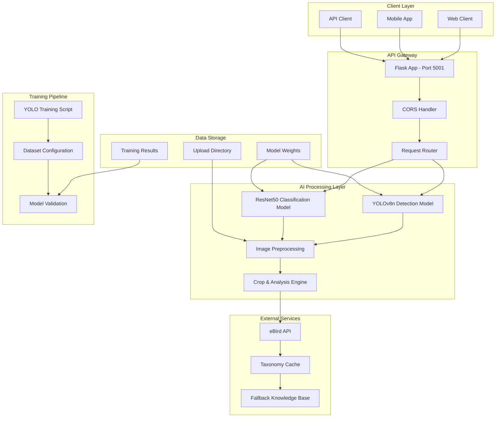
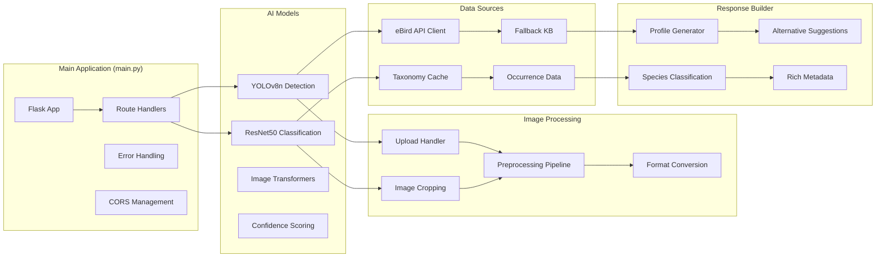
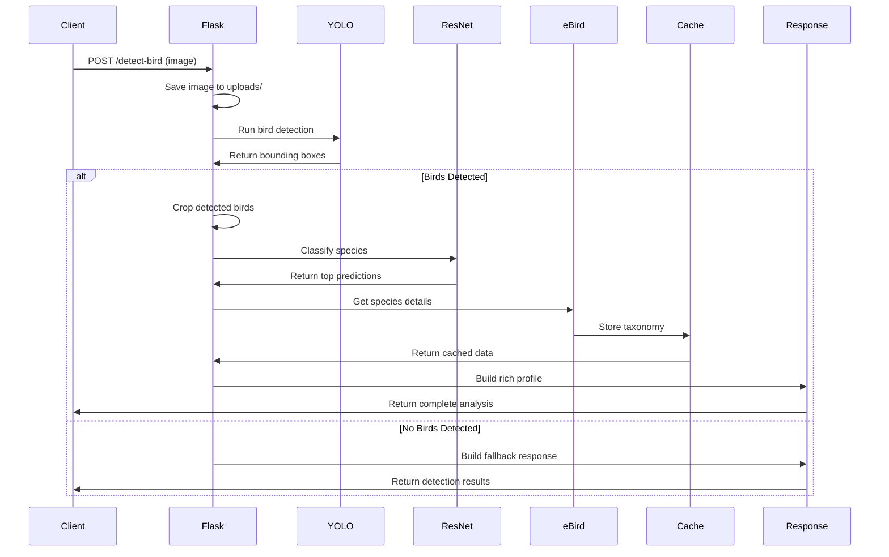
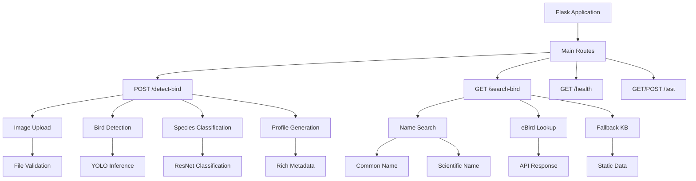
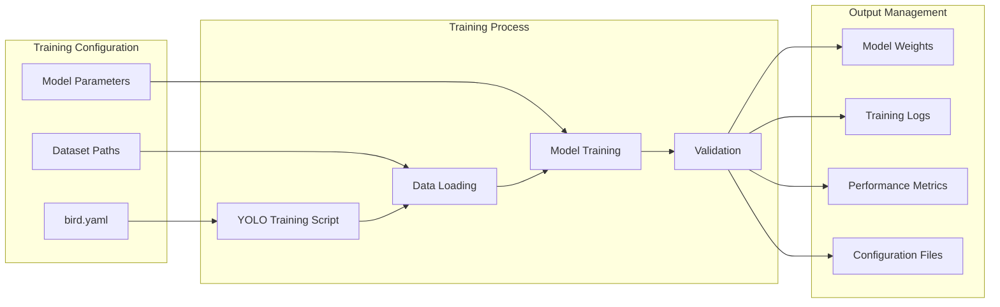
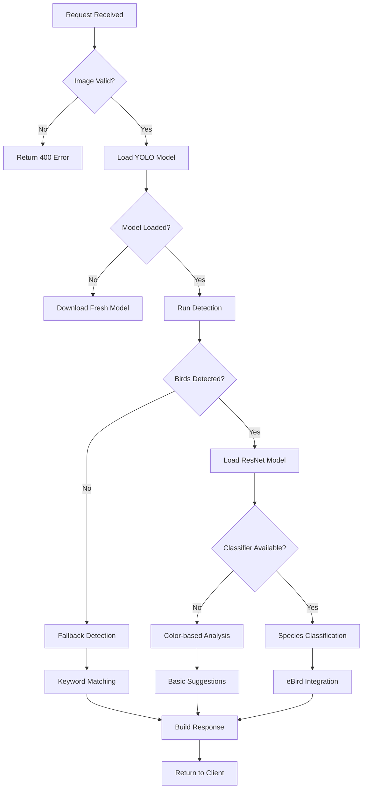
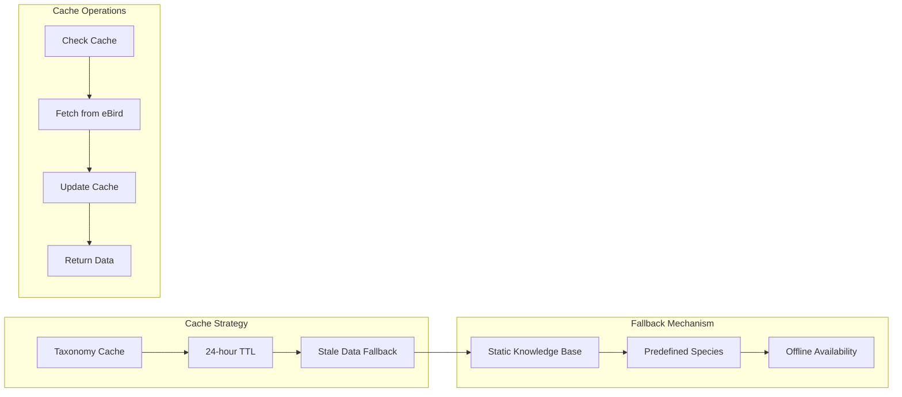

# BirdScanAI - System Architecture Diagram

## High-Level System Architecture



## Detailed Component Architecture



## Data Flow Diagram



## API Endpoint Structure



## Model Architecture

```mermaid
graph TB
    subgraph "YOLOv8n Detection Model"
        A1[Input Image 640x640]
        A2[Backbone Network]
        A3[Neck (FPN)]
        A4[Detection Head]
        A5[Bounding Boxes + Confidence]
    end
    
    subgraph "ResNet50 Classification Model"
        B1[Input Image 224x224]
        B2[Convolutional Layers]
        B3[Residual Blocks]
        B4[Global Average Pooling]
        B5[Fully Connected Layer]
        B6[Species Probabilities]
    end
    
    subgraph "Image Processing Pipeline"
        C1[Original Image]
        C2[Detection Results]
        C3[Cropped Regions]
        C4[Preprocessed Tensors]
        C5[Classification Results]
    end
    
    A1 --> A2
    A2 --> A3
    A3 --> A4
    A4 --> A5
    
    B1 --> B2
    B2 --> B3
    B3 --> B4
    B4 --> B5
    B5 --> B6
    
    C1 --> C2
    C2 --> C3
    C3 --> C4
    C4 --> C5
```

## Training Pipeline



## System Dependencies

```mermaid
graph TD
    subgraph "Core Dependencies"
        A[Flask]
        B[PyTorch]
        C[Ultralytics]
        D[OpenCV]
    end
    
    subgraph "AI/ML Libraries"
        E[Torchvision]
        F[PIL/Pillow]
        G[Numpy]
        H[Requests]
    end
    
    subgraph "System Requirements"
        I[Python 3.10.13]
        J[Virtual Environment]
        K[Model Weights]
        L[GPU Support (Optional)]
    end
    
    A --> B
    B --> C
    B --> D
    C --> E
    D --> F
    E --> G
    F --> H
    
    I --> J
    J --> K
    K --> L
```

## Error Handling & Fallbacks



## Cache Management



## Performance Optimization

```mermaid
graph TB
    subgraph "Model Optimization"
        A[Model Quantization]
        B[Batch Processing]
        C[GPU Acceleration]
        D[Memory Management]
    end
    
    subgraph "API Optimization"
        E[Async Processing]
        F[Request Timeouts]
        G[Connection Pooling]
        H[Response Caching]
    end
    
    subgraph "Image Optimization"
        I[Resize Operations]
        J[Format Conversion]
        K[Compression]
        L[Streaming]
    end
    
    A --> B
    B --> C
    C --> D
    E --> F
    F --> G
    G --> H
    I --> J
    J --> K
    K --> L
``` 

