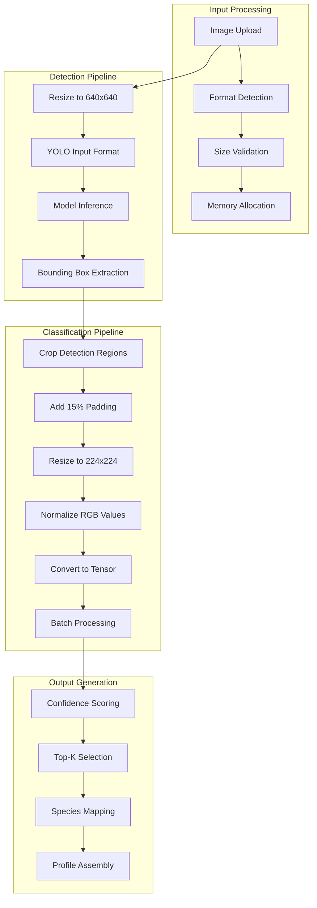
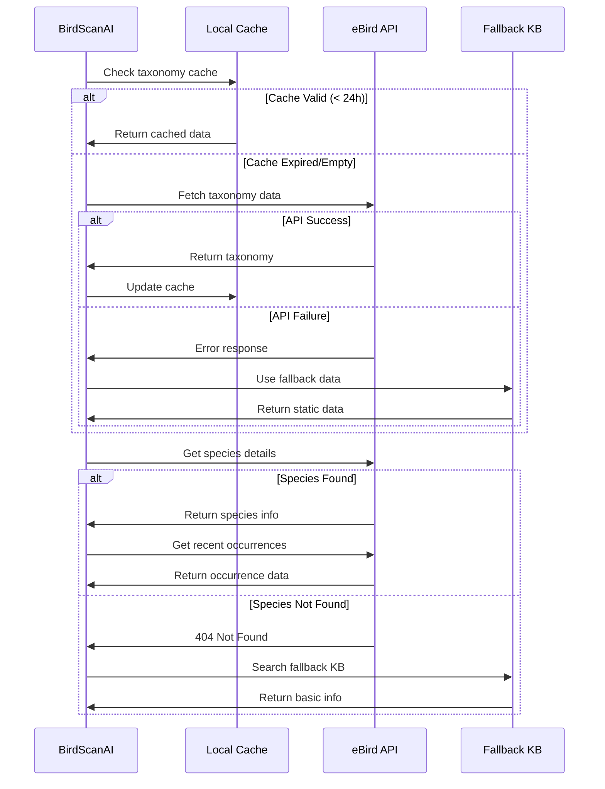
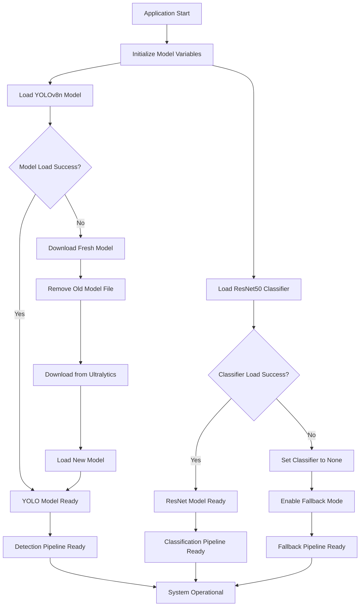
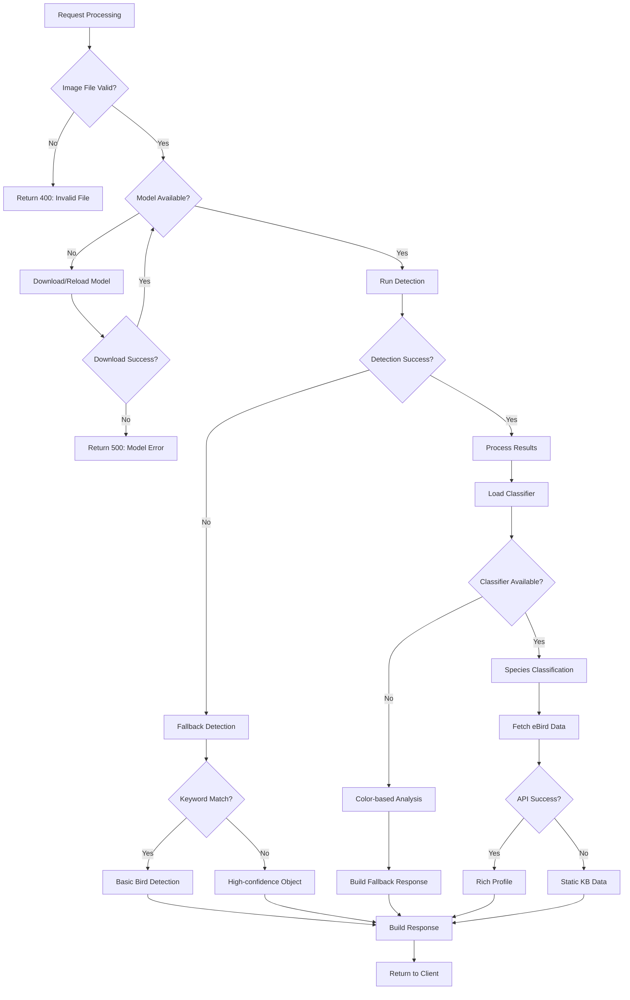
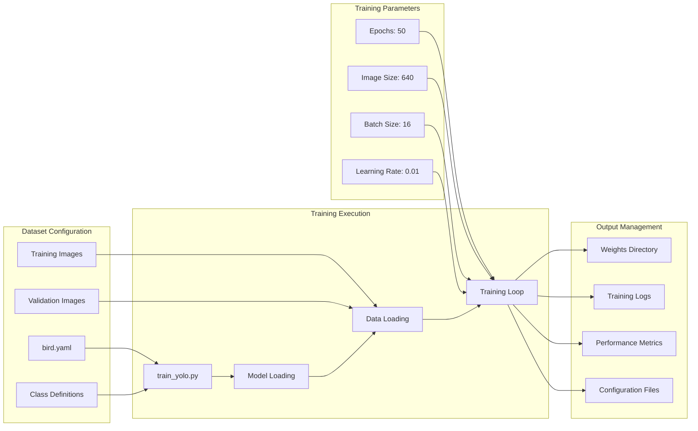
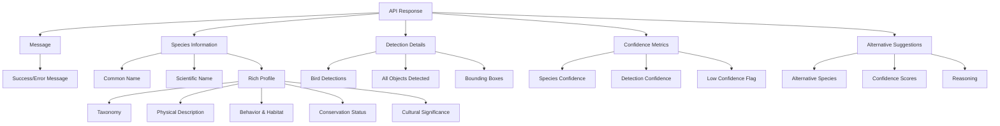
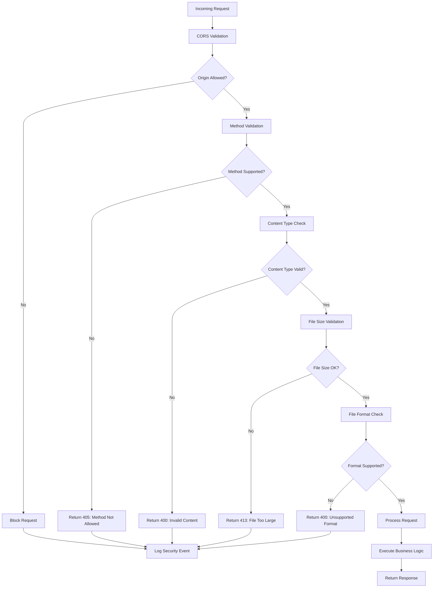
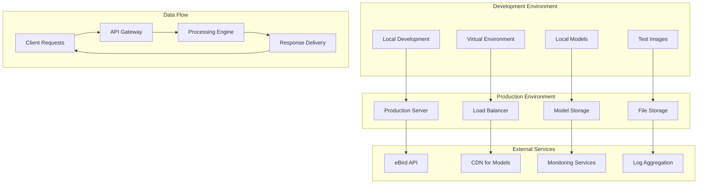

# BirdScanAI - Detailed Technical Diagrams

## Bird Detection Workflow

```mermaid
flowchart TD
    A[Image Upload] --> B[File Validation]
    B --> C[Save to Uploads Directory]
    C --> D[Load YOLOv8n Model]
    D --> E[Preprocess Image 640x640]
    E --> F[Run YOLO Detection]
    F --> G{Detection Results?}
    
    G -->|Success| H[Parse Bounding Boxes]
    G -->|Failure| I[Fallback Detection]
    
    H --> J[Filter Bird Class (ID 14)]
    J --> K[Apply Confidence Threshold 0.1]
    K --> L[Extract Bird Regions]
    
    I --> M[Keyword-based Detection]
    M --> N[High-confidence Object Analysis]
    
    L --> O[Crop Bird Regions + 15% Padding]
    N --> O
    O --> P[Load ResNet50 Classifier]
    
    P --> Q{Classifier Available?}
    Q -->|Yes| R[Preprocess Crops 224x224]
    Q -->|No| S[Color-based Analysis]
    
    R --> T[Batch Classification]
    T --> U[Top-5 Species Prediction]
    
    S --> V[RGB Color Analysis]
    V --> W[Species Suggestions]
    
    U --> X[Fetch eBird Data]
    W --> X
    X --> Y[Build Rich Profile]
    Y --> Z[Return Response]
```

## Image Processing Pipeline



## eBird API Integration Flow



## Model Loading & Management



## Error Handling & Recovery



## Training Configuration & Results



## Response Data Structure



## System Performance Metrics

```mermaid
graph TB
    subgraph "Response Time Metrics"
        A[Image Upload] --> B[File Processing]
        B --> C[Model Loading]
        C --> D[Detection Time]
        D --> E[Classification Time]
        E --> F[API Response Time]
    end
    
    subgraph "Accuracy Metrics"
        G[Detection Precision]
        H[Classification Accuracy]
        I[Species Identification Rate]
        J[Fallback Success Rate]
    end
    
    subgraph "Resource Usage"
        K[Memory Consumption]
        L[CPU Utilization]
        M[GPU Usage (if available)]
        N[Disk I/O]
    end
    
    subgraph "Reliability Metrics"
        O[Uptime Percentage]
        P[Error Rate]
        Q[Recovery Time]
        R[Cache Hit Rate]
    end
    
    A --> G
    D --> H
    E --> I
    F --> J
    
    C --> K
    D --> L
    E --> M
    B --> N
    
    F --> O
    G --> P
    H --> Q
    I --> R
```

## Security & Access Control



## Deployment Architecture

