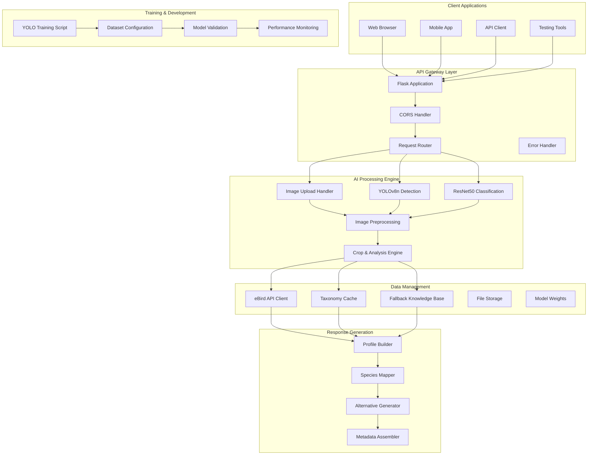
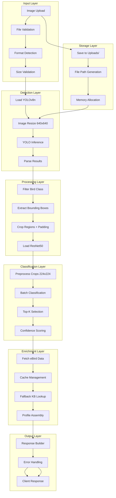
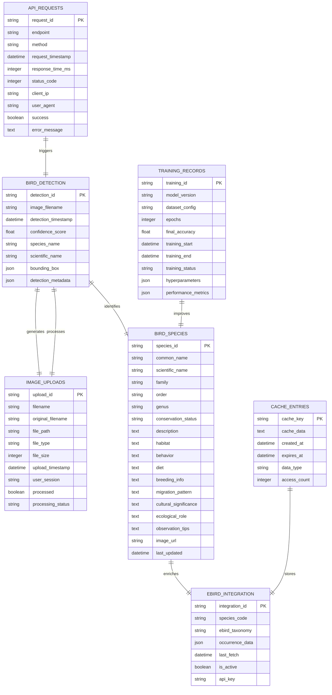
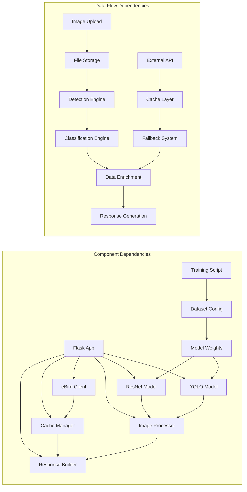
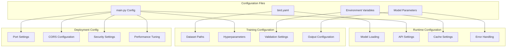
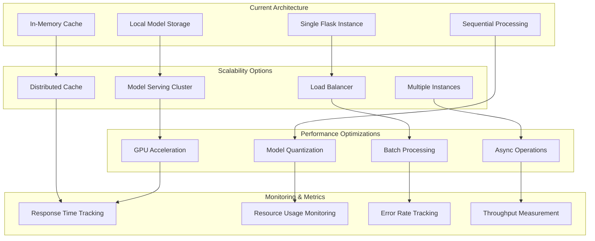
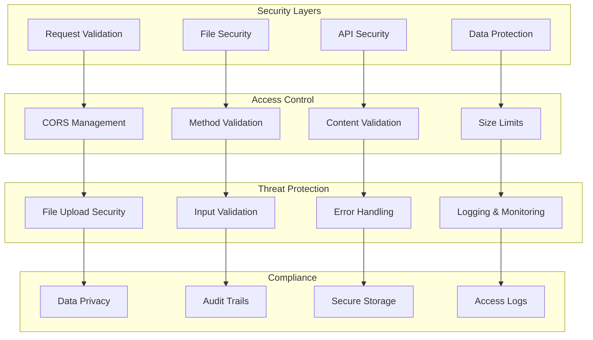
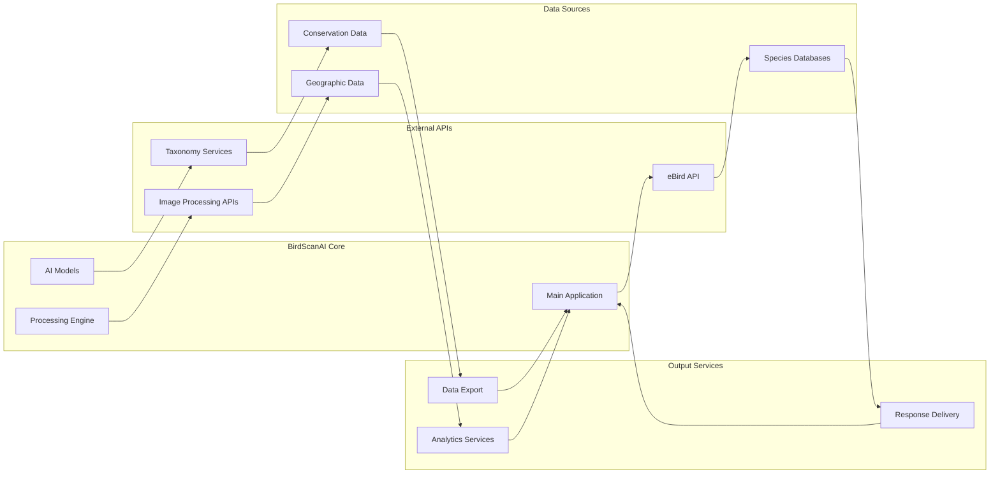

# BirdScanAI - Complete System Overview

## System Architecture Overview

## Complete Data Flow Architecture

## Database Schema & Data Models

## Component Interaction Matrix

## System Configuration Architecture

## Performance & Scalability Architecture

## Security & Access Control Architecture

## Integration Points & External Services

